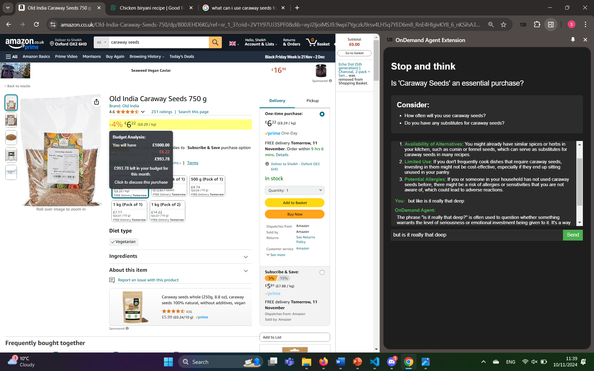

# OxBIG Hackathon - CompulseControl
We created a Financial App targeted at compulsive spenders. CompulseControl (CC) helps to reign in reckless expenditure by bringing spending history and budget goals into context for the consumer. 

<p align="center">
  
</p>

# Purpose/Usage
We know that people can suddenly (sometimes chronically) get urges to buy things they see at stores, both inperson and online. In those situations they are often alone with nothing to inhibit them from making bad financial decisions. Nobody wants to open up their banking app and check their credit card debt or budgeting goals. CC brings in a friendly and intuitive option to turn to in these situations, where we believe users can properly consolidate the pros and cons of a purchase before making it.

<p align="center">
  
</p>

To add as a chrome extension:
- Download the latest release zip from the github page.
- Unzip into a new folder and go to Chrome->Extensions->Enable Developer Mode
- Press "Load Unpacked" and select the folder
- You should now have it added!

<p align="center">
  
</p>

# OnDemand API Utilization
We used OD's agent marketplace to browse and select the most helpful finance-adjacent chatbots that users vouched for.

<p align="center">
  
</p>

However, we ended up creating our own knowledge base agent which had integrated, up to date information on an example user's spending history. From there we used OD's playground feature to experiment and finetune the model. Examples of doing this included doing prompt engineering on it to get more desireable outputs.

<p align="center">
  
</p>
 
We also lowered the temperature to 0.5 to minimise hallucinated purchases whilst keeping the advice dynamic. All our settings could be saved as a named preset for easy access to it later on.

<p align="center">
  
</p>

 Once we were happy to integrate, we used OD's generate code feature for a simple and quick way to facilitate API access for our chrome extension. Amazingly, it let you specify which language to generate the code in as well (we used Javascript).

# Members/Roles

Ying Ying Lim
- Software + Data Engineering
- Fullstack Development and Merging Implementations

Mingda Santos
- Software Engineering, Project Coordination

Sheikh Mohiddin
- UI/UX Design and Implementation

Francis Madden
- Asset creation and QA testing

Xiaoyin (Connie) Li
- Presentational materials

## Backend Setup

1. Install the relevant Python libraries:

    ```bash
    pip install -r requirements.txt
    ```

2. To change the permission on the `run.sh` file, run the following command:

    ```bash
    chmod +x run.sh
    ```

3. To run the backend servers:

    ```bash
    bash run.sh
    ```

Note: Run the backend servers before using it on chrome. 

## Final Product

<p align="center">
  
  
</p>

## FAQs
- If the extension cannot run due to a '__pycache__' error, please delete the pycache folder because it generates upon running for the first time.

- If the chatbot is not responding, wait a bit before sending another request. It is possible the backend socket is still waiting to connect to the server and you entered a query too quickly 